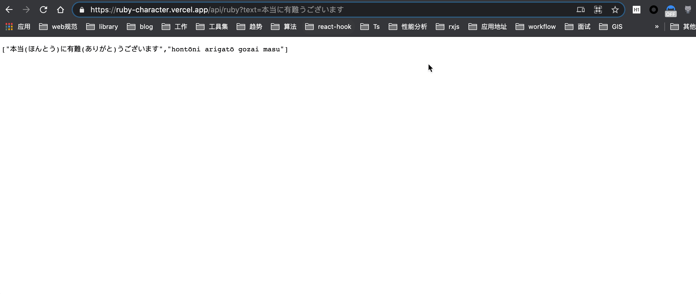

# Bob-plugin-kuroshiro

A Bob plugin for [Ruby Charater](https://en.wikipedia.org/wiki/Ruby_character).

## Installation

- [下载地址](https://github.com/EliazTray/bob-plugin-kuroshiro/releases/)

找到 `kuroshiro.bobplugin.zip` 下载，解压后，双击安装即可。

## API

这是我自己部署在 vercel serverless 上的可用服务。(国内翻墙)

[https://ruby-character.vercel.app/api/ruby?text=感じ取れたら手を繋ごう、重なるのは人生のライン%20and%20 レミリア最高！](https://ruby-character.vercel.app/api/ruby?text=%E6%84%9F%E3%81%98%E5%8F%96%E3%82%8C%E3%81%9F%E3%82%89%E6%89%8B%E3%82%92%E7%B9%8B%E3%81%94%E3%81%86%E3%80%81%E9%87%8D%E3%81%AA%E3%82%8B%E3%81%AE%E3%81%AF%E4%BA%BA%E7%94%9F%E3%81%AE%E3%83%A9%E3%82%A4%E3%83%B3%20and%20%E3%83%AC%E3%83%9F%E3%83%AA%E3%82%A2%E6%9C%80%E9%AB%98%EF%BC%81)

## TODO

- [ ] 无需网络请求，转换旁注标记使用本地字典进行处理(需要改造 kuroshiro 依赖文件的引用路径)
- [ ] 支持 furigana(注音假名), 跟进[Bob Issue](https://github.com/ripperhe/Bob/issues/162)

## Inspired

- [Bob](https://github.com/ripperhe/Bob/)
- [kuroshiro](https://github.com/hexenq/kuroshiro/)
